# Pool

<!-- MarkdownTOC levels="1,2" -->

- [Practice](#practice)
- [Stroke](#stroke)
    + [`prz` Pureness](#prz-pureness)
    + [`spd` Speed](#spd-speed)
    + [`pwr` Power](#pwr-power)
- [Core](#core)
    + [`psn` Position](#psn-position)
    + [`smk` Shotmaking](#smk-shotmaking)
    + [`drn` Direction](#drn-direction)
    + [`lyt` Layout](#lyt-layout)
- [Special](#special)
    + [`bnk` Banks](#bnk-banks)
    + [`kik` Kicks](#kik-kicks)
    + [`sft` Safeties](#sft-safeties)
    + [`brk` Breaks](#brk-breaks)
    + [`jmp` Jumps](#jmp-jumps)
- [Work in Progress](#work-in-progress)

<!-- /MarkdownTOC -->

# Practice
- Warmup
- Stroke
- Core
- Special

# Stroke
## `prz` Pureness
## `spd` Speed
## `pwr` Power

# Core
## `psn` Position
### big1
- Name: IPAT1 Endless
- Desc: Endless big area position.
- Score: first|max
- Source: IPAT1
- Added: 2023/08/16

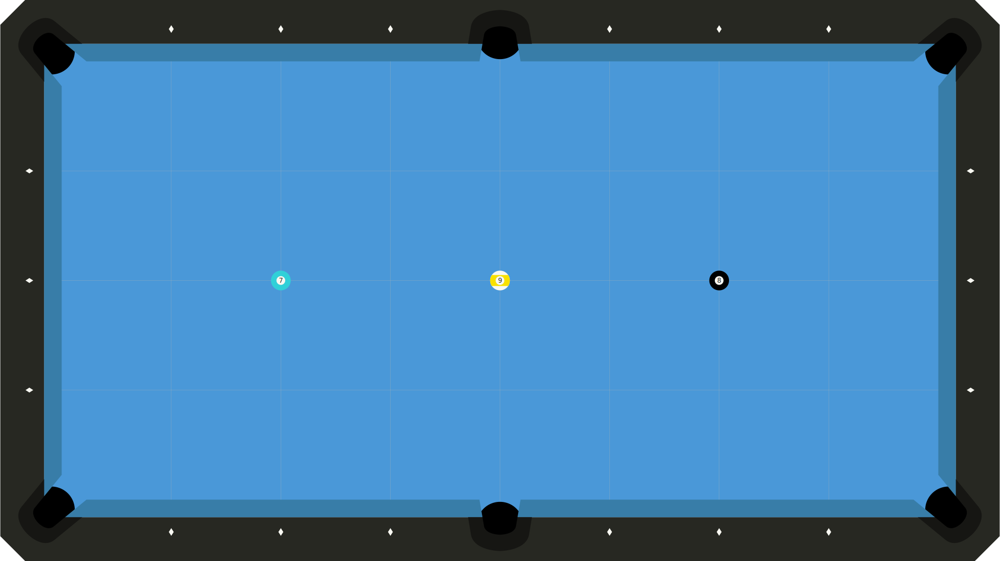

### lil1
- Name: L Drill
- Desc: Endless small area position.
- Score: first|max
- Source: IPAT2
- Added: 2023/08/16

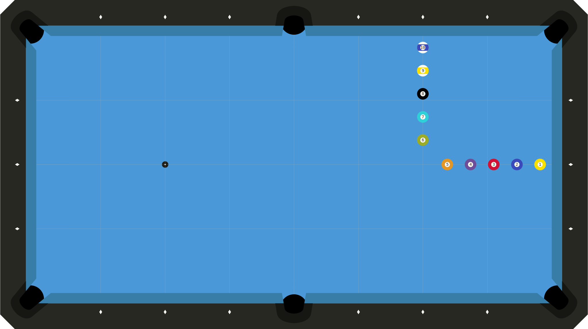

### big2
- Name: IPAT1 Big Head
- Desc: Endless big area position.
- Score: first|max
- Source: IPAT1
- Added: 2023/08/16

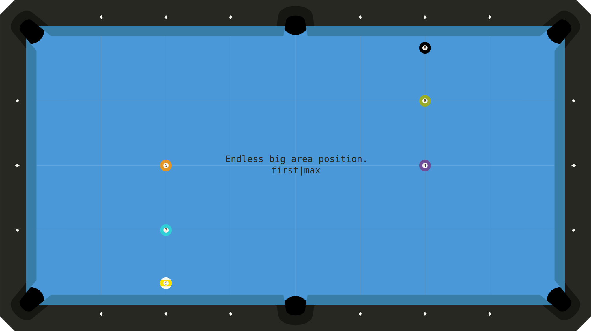

### lil2
- Name: IPAT2 Longcut
- Desc: Endless longcuts, BIH between sides.
- Score: first|max
- Source: IPAT2
- Added: 2023/08/16

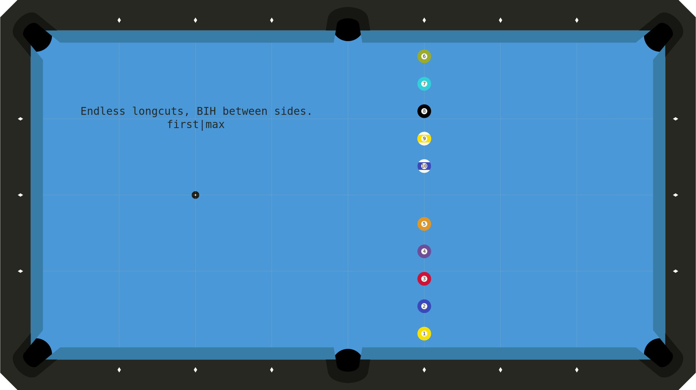

## `smk` Shotmaking

## `drn` Direction
### drn1
- Name: Short Cut Wheel
- Desc: Short rail hero cut shot (L+R).
- Score: num_shots
- Variants: Follow, draw
- Source: Self
- Added: 2023/08/16
- Notes: Previously SMK001, added 2023/02/06.

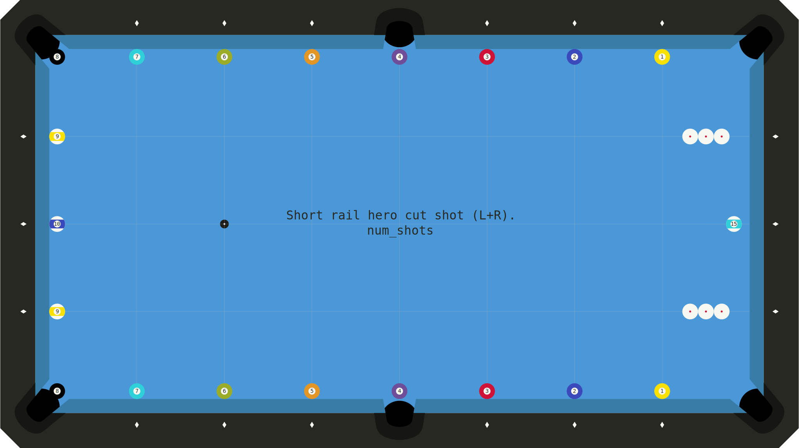

## `lyt` Layout

# Special
## `bnk` Banks
## `kik` Kicks
### KIK001
- Desc: Kick each OB one rail.
- Score: # successful
- Source: [Billiard University Exam 2](https://billiarduniversity.org/testing/exams/)
- Added: 2023/02/09

## `sft` Safeties
### SFT001
Billiard University Exam 2 Safeties Drill (2023/02/08)

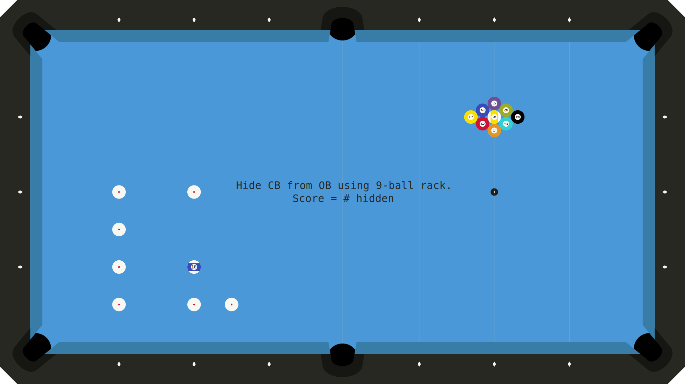

## `brk` Breaks
## `jmp` Jumps

# Work in Progress
### SMK002
- Desc: Back cut near pocket plus two- or three-rail full table position.
- Score: Shots made with position / 10.
- Source: Self
- Added: 2023/02/07

### SMK003
- Desc: Big off-angle follow shot.
- Score: Shots made with position / 10.
- Source: Self
- Added: 2023/02/09
- Notes: Tends to be overcut.

### SMK004
- Desc: Weird short-side thinnish cut shot near end rail.
- Score: Shots made with position / 10.
- Source: Self
- Added: 2023/02/13

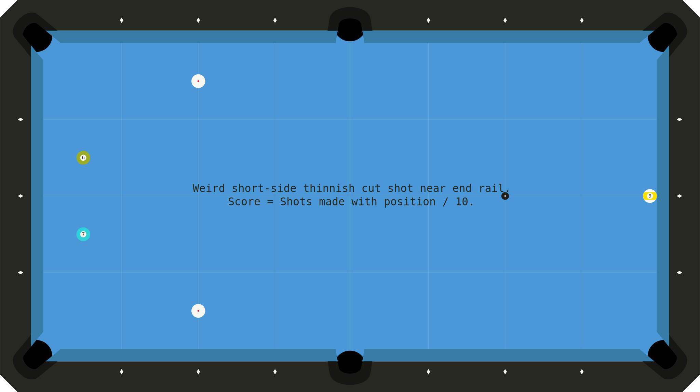

### SMK005
- Desc: Long cut shots into opposite corner.
- Score: Shots made with position / 10.
- Source: Self
- Added: 2023/03/04

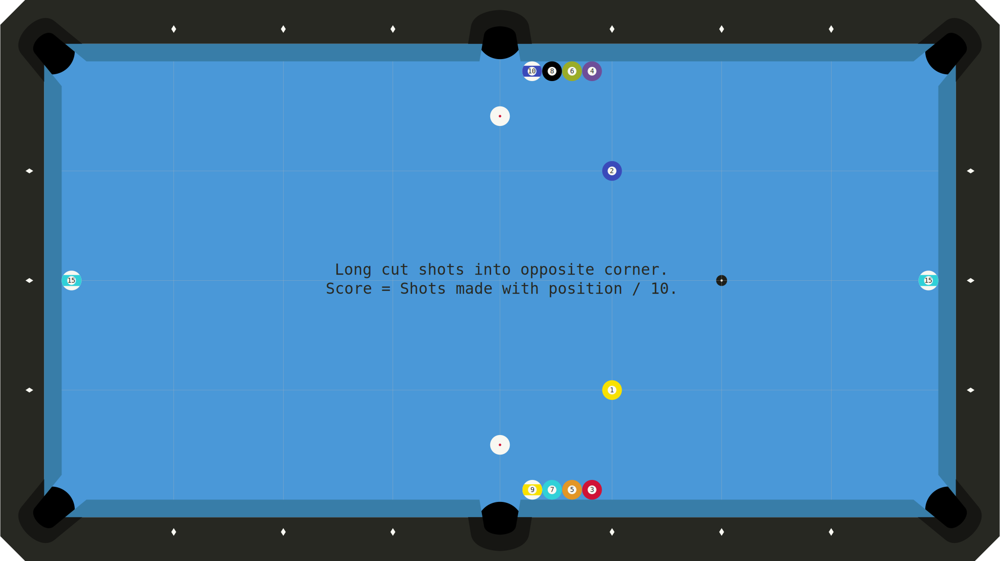

### SMK006
- Desc: Tricky not-quite-straight-or-cut shot with follow for position.
- Score: Shots made with position / 10.
- Source: Self
- Added: 2023/03/05
- Notes: Tends to be overcut.

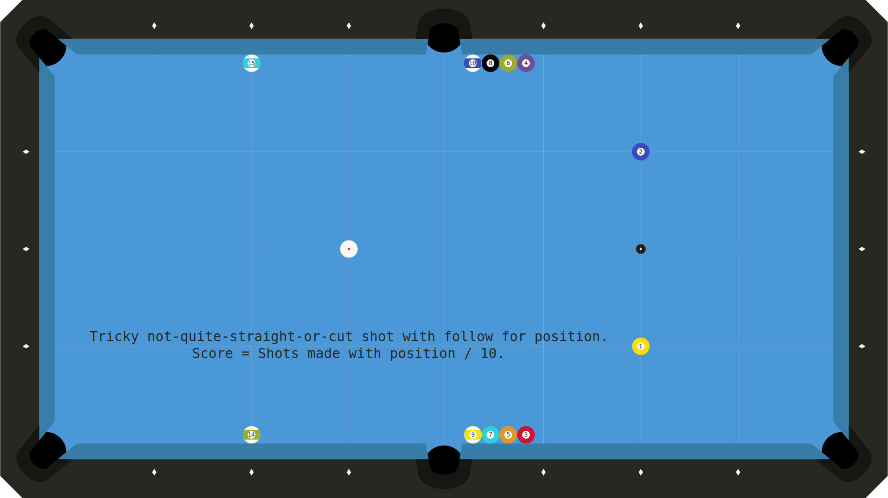

### SMK007
- Desc: 2D to 2D cut shot that comes up in drills I like.
- Score: Shots made with position / 10.
- Source: Self
- Added: 2023/04/02

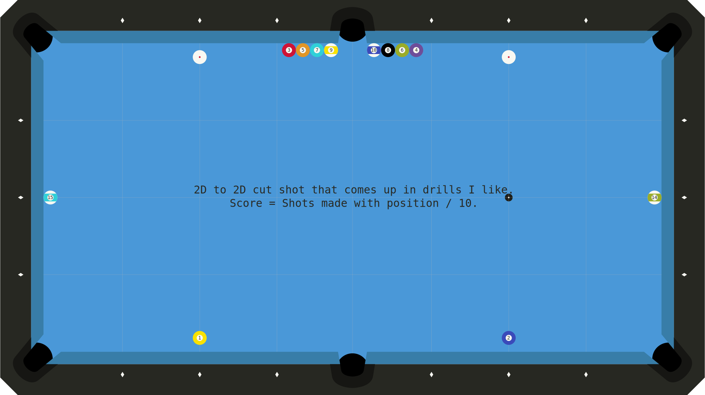

### SMK008
- Desc: Small angle backcuts with big follow (long rail).
- Score: Attempts required to get 10 successes.
- Source: Self
- Added: 2023/06/18
- Notes: Tends to be overcut.

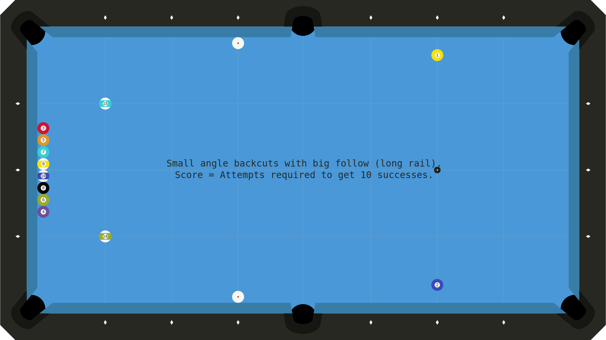

### SMK009
- Desc: Small angle backcuts with big follow (short rail).
- Score: Attempts required to get 10 successes.
- Source: Self
- Added: 2023/06/18
- Notes: Tends to be overcut.

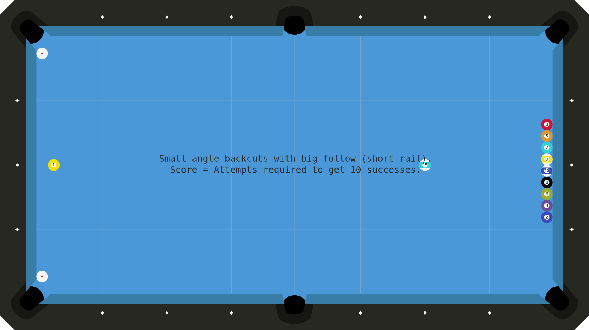
