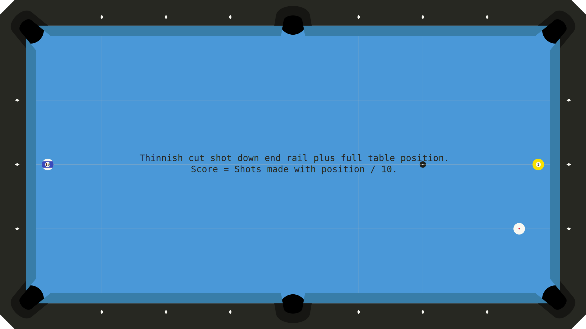
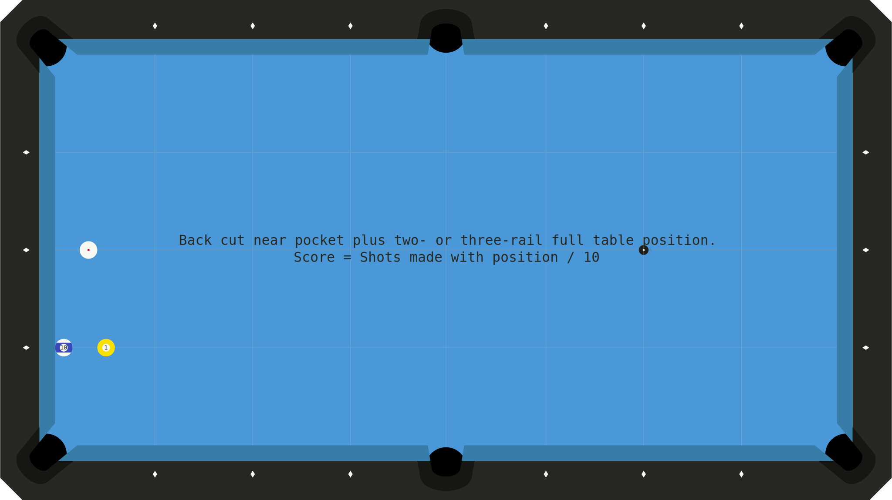
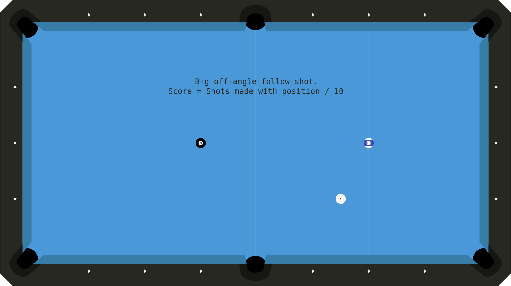
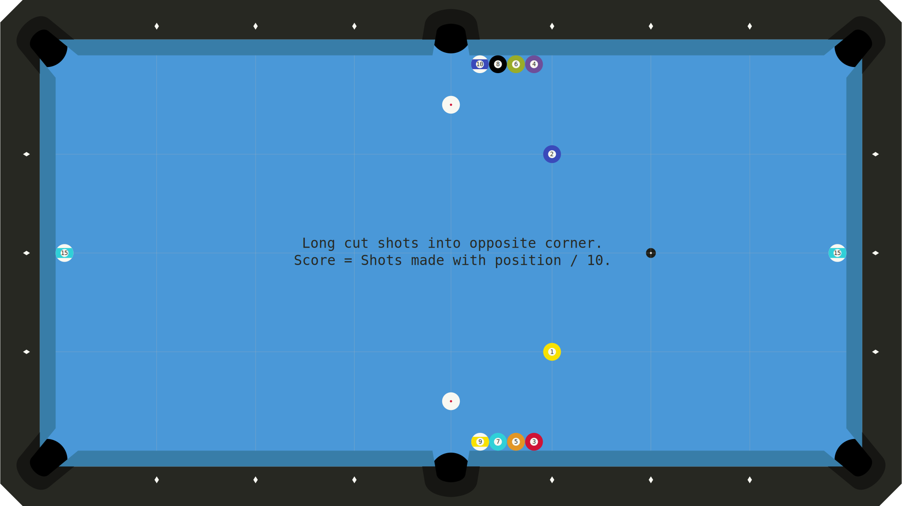
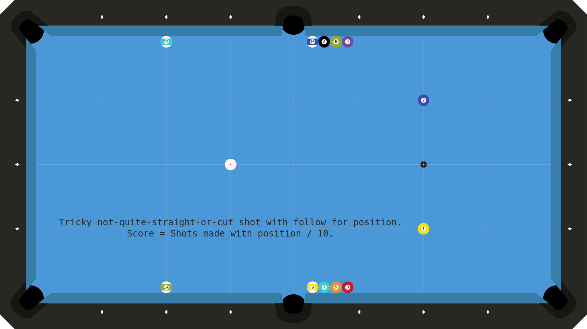
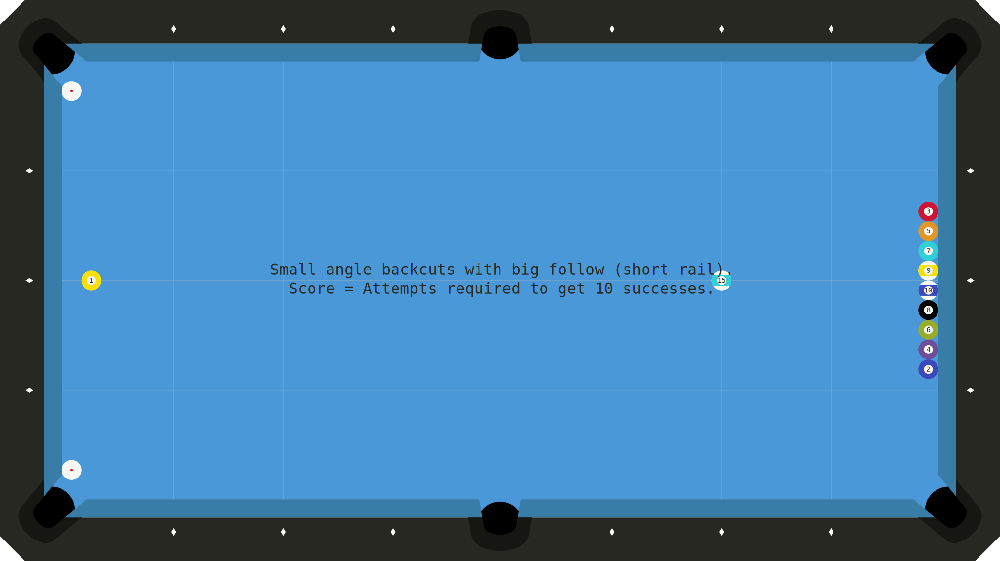
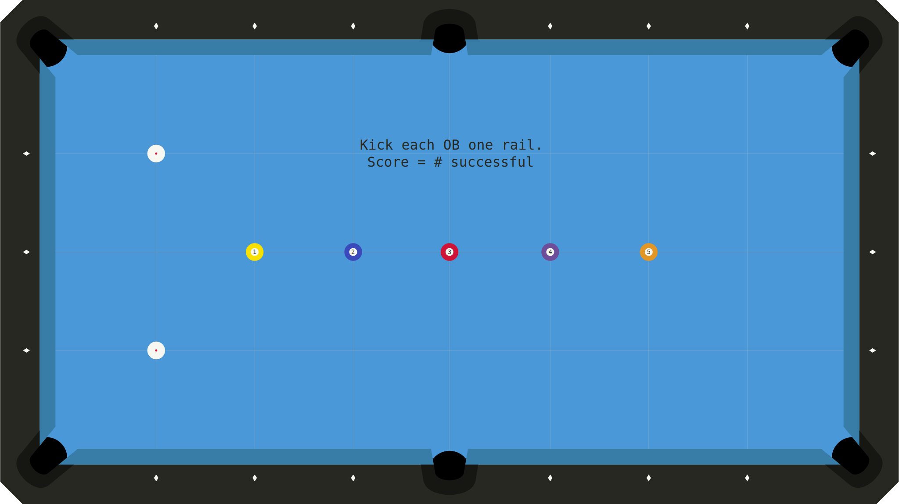

# Pool

# Game Areas
- Stroke (STK)
- Shotmaking (SMK)
- Position (PSN)
    * Speed
    * Direction
    * Patterns
- Banking (BNK)
- Kicking (KIK)
- Safeties (SFT)
- Breaking (BRK)
- Jumping (JMP)

<!-- MarkdownTOC levels="1,2" -->

- [Shotmaking](#shotmaking)
    + [SMK001](#smk001)
    + [SMK002](#smk002)
    + [SMK003](#smk003)
    + [SMK004](#smk004)
    + [SMK005](#smk005)
    + [SMK006](#smk006)
    + [SMK007](#smk007)
    + [SMK008](#smk008)
    + [SMK009](#smk009)
- [Kicking](#kicking)
    + [KIK001](#kik001)
- [Safeties](#safeties)
    + [SFT001](#sft001)

<!-- /MarkdownTOC -->

# Shotmaking
## SMK001
- Desc: Thinnish cut shot down end rail plus full table position.
- Score: Shots made with position / 10.
- Source: Self
- Added: 2023/02/06

## SMK002
- Desc: Back cut near pocket plus two- or three-rail full table position.
- Score: Shots made with position / 10.
- Source: Self
- Added: 2023/02/07

## SMK003
- Desc: Big off-angle follow shot.
- Score: Shots made with position / 10.
- Source: Self
- Added: 2023/02/09
- Notes: Tends to be overcut.

## SMK004
- Desc: Weird short-side thinnish cut shot near end rail.
- Score: Shots made with position / 10.
- Source: Self
- Added: 2023/02/13

## SMK005
- Desc: Long cut shots into opposite corner.
- Score: Shots made with position / 10.
- Source: Self
- Added: 2023/03/04

## SMK006
- Desc: Tricky not-quite-straight-or-cut shot with follow for position.
- Score: Shots made with position / 10.
- Source: Self
- Added: 2023/03/05
- Notes: Tends to be overcut.

## SMK007
- Desc: 2D to 2D cut shot that comes up in drills I like.
- Score: Shots made with position / 10.
- Source: Self
- Added: 2023/04/02

## SMK008
- Desc: Small angle backcuts with big follow (long rail).
- Score: Attempts required to get 10 successes.
- Source: Self
- Added: 2023/06/18
- Notes: Tends to be overcut.

## SMK009
- Desc: Small angle backcuts with big follow (short rail).
- Score: Attempts required to get 10 successes.
- Source: Self
- Added: 2023/06/18
- Notes: Tends to be overcut.

# Kicking
## KIK001
- Desc: Kick each OB one rail.
- Score: # successful
- Source: [Billiard University Exam 2](https://billiarduniversity.org/testing/exams/)
- Added: 2023/02/09

# Safeties
## SFT001
Billiard University Exam 2 Safeties Drill (2023/02/08)

