# Pool

<!-- MarkdownTOC levels="1,2" -->

- [Routine](#routine)
- [Stroke](#stroke)
    + [`pur` Pure](#pur-pure)
    + [`spd` Speed](#spd-speed)
    + [`pwr` Power](#pwr-power)
- [Core](#core)
    + [`psn` Position](#psn-position)
    + [`smk` Shotmaking](#smk-shotmaking)
    + [`drn` Direction](#drn-direction)
- [Special](#special)
    + [`bnk` Banks](#bnk-banks)
    + [`kik` Kicks](#kik-kicks)
    + [`sft` Safeties](#sft-safeties)
    + [`brk` Breaks](#brk-breaks)
    + [`jmp` Jumps](#jmp-jumps)
- [Work in Progress](#work-in-progress)

<!-- /MarkdownTOC -->

# Routine
|     | WMP |  STK  | COR  | SPL |
|:---:|:---:|:-----:|:----:|:---:|
| Sun | `~` | `fsd` | `b`  |  –  |
| Mon | `~` |  `f`  | `ls` |     |
| Tue | `~` |  `s`  | `bd` |     |
| Wed | `~` |  `d`  | `ls` |     |
| Thu | `~` |  `f`  | `bd` |     |
| Fri | `~` |  `s`  | `ls` |     |
| Sat | `~` |  `d`  | `bd` |     |

<!-- ### code
- Name:
- Desc:
- Script:
- Score:
- Date:
- Source:
- Image:   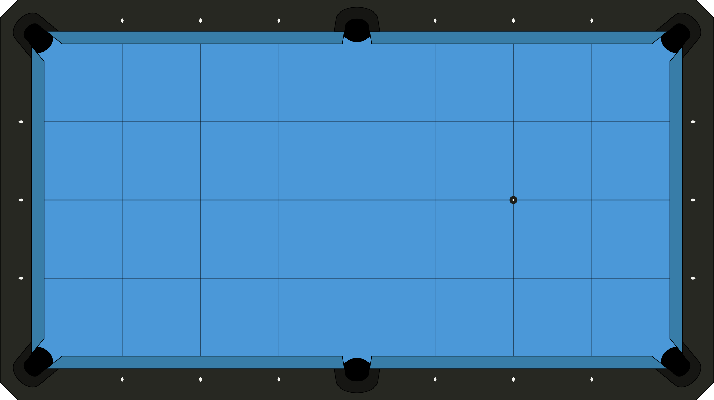 -->

# Stroke
## `pur` Pure
### pur1
- Name: Pure Follow 1
- Desc: Follow into pocket.
- Score: num_shots
- Source: IPAT1
- Date: 2023/02/01
- Image:   

### pur2
- Name: OTR Endrail
- Desc: Straight in shots off end rail.
- Score: num_shots
- Source: Margaret Fefilova
- Date: 2023/08/24
- Image:   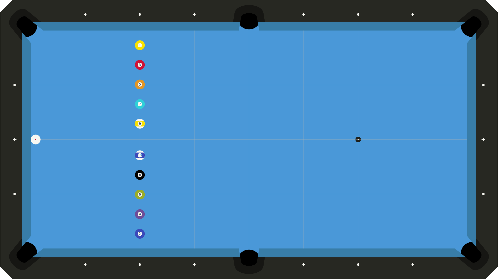

### pur3
- Name: OTR Corners
- Desc: Straight in shots off side rails into corner pockets.
- Score: num_shots
- Source: IPAT2
- Date: 2023/08/24
- Image:   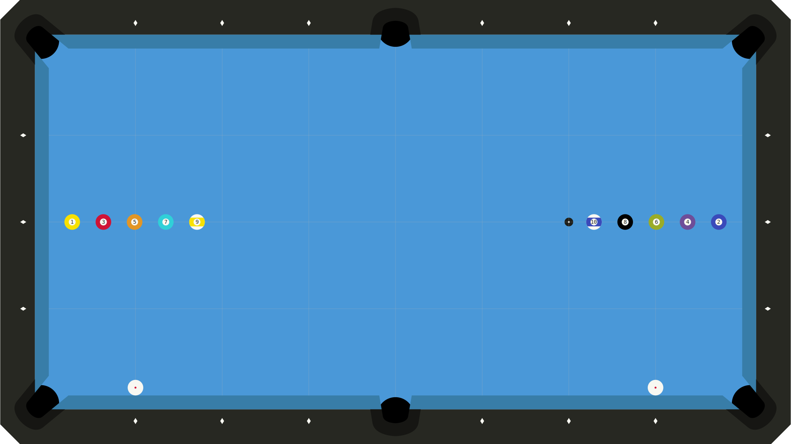

### pur4
- Name: OTR Sides
- Desc: Straight in shots off side rails into side pockets.
- Score: num_shots
- Source: Self
- Date: 2023/08/24
- Image:   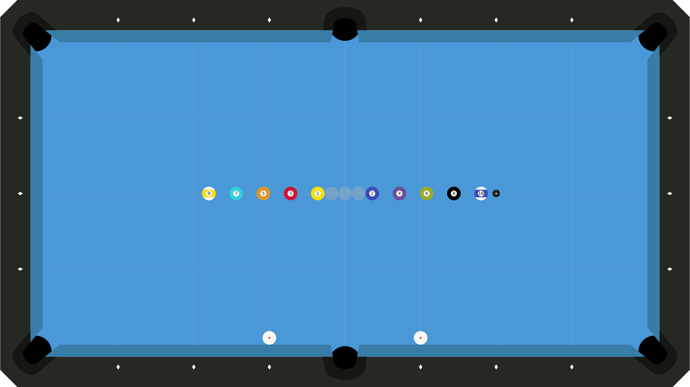

### pur5
- Name: MightyX Stop
- Desc: Stop dead.
- Score: first|max
- Source: Niels Feijen
- Date: 2023/08/29
- Image:   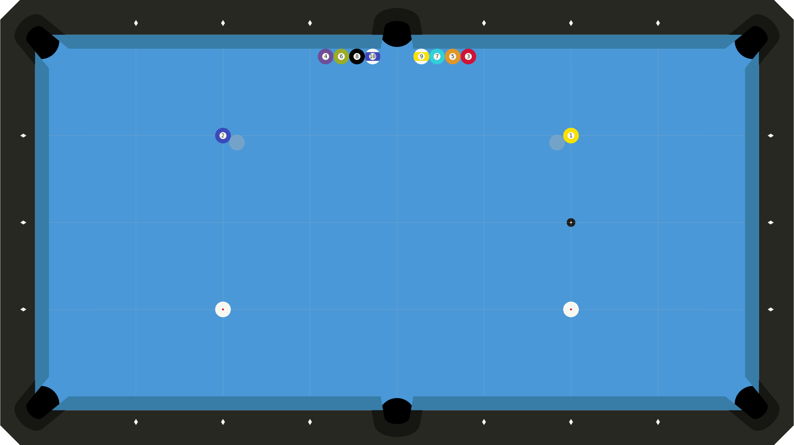

### pur6
- Name: Center Stop
- Desc: Stop dead.
- Score: first|max
- Source: Self
- Date: 2023/08/29
- Image:   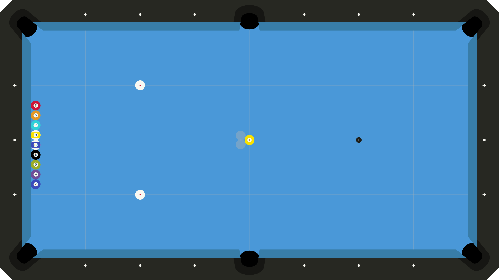

### pur7
- Name: MightyX Stun
- Desc: Stun forward towards pocket.
- Score: first|max
- Source: Self
- Date: 2023/08/29
- Image:   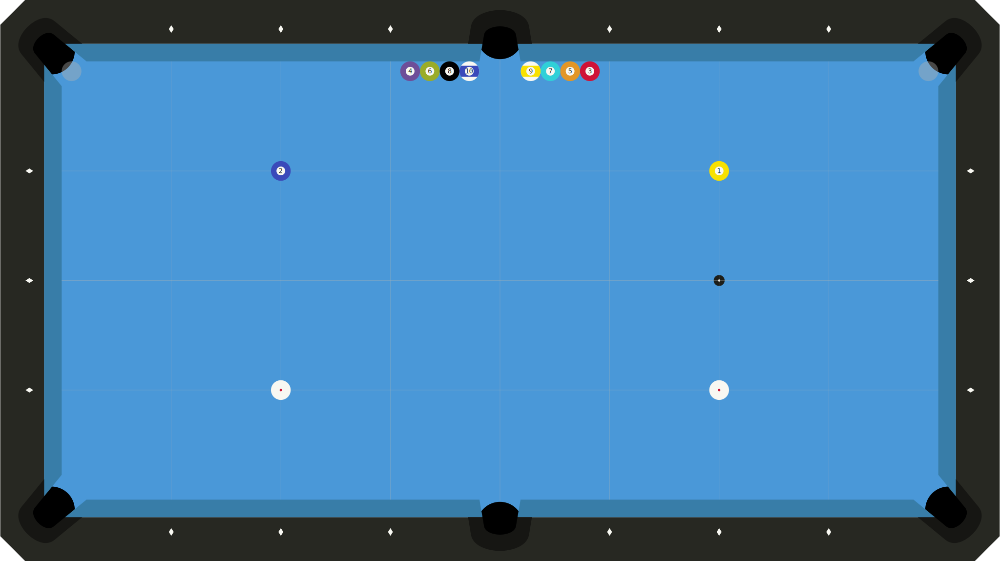

### pur8
- Name: Pure Draw 1.5
- Desc: Straight draw back to end rail.
- Score: num_shots
- Source: IPAT1/2
- Date: 2023/08/29
- Image:   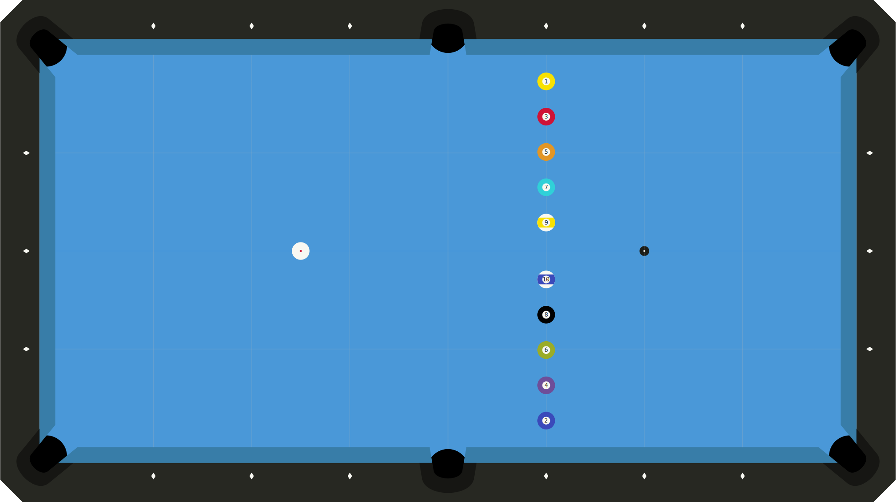

<!-- ───────────────────────────────────────────────────────────────────────────── -->

## `spd` Speed
### spd1
- Name: Touch of Follow 1
- Desc: Straight follow, must pass prev shot and overlap 3-ball region beyond.
- Score: num_shots
- Source: Self
- Date: 2023/08/23
- Image:   

### spd2
- Name: Touch of Draw 1
- Desc: Straight draw, must pass prev shot and overlap 3-ball region beyond.
- Score: num_shots
- Source: Self
- Date: 2023/08/29
- Image:   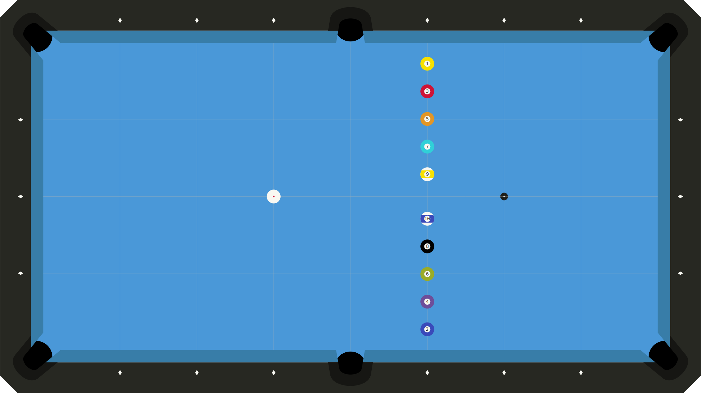

<!-- ───────────────────────────────────────────────────────────────────────────── -->

## `pwr` Power
### pwr1
- Name: MightyX Draw
- Desc: Straight draw back to end rail.
- Score: num_shots
- Source: Self
- Date: 2023/08/29
- Image:   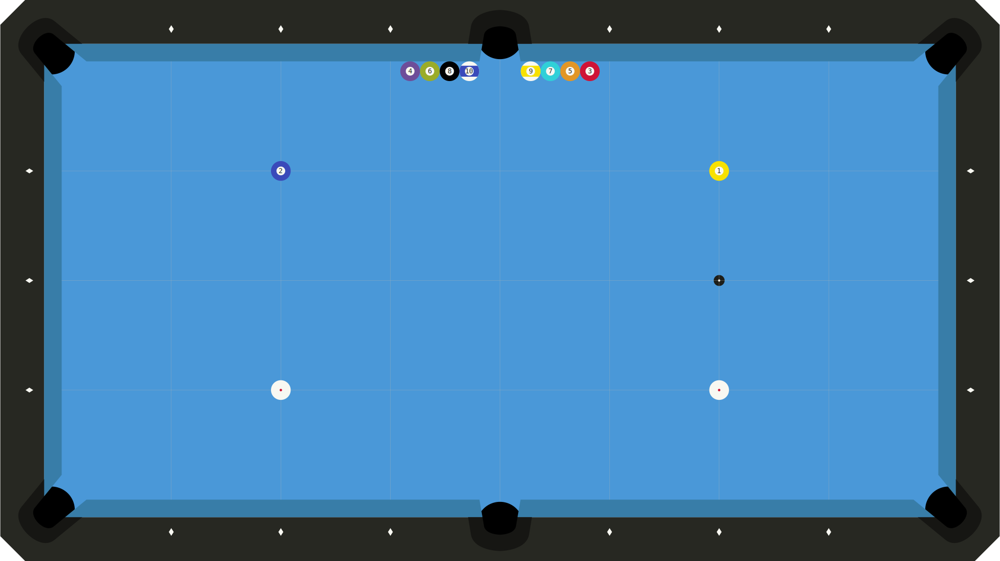

<!-- ───────────────────────────────────────────────────────────────────────────── -->

# Core
## `psn` Position
### big1
- Name: Center 1
- Desc: Endless center table shots.
- Score: first|max
- Source: IPAT1
- Added: 2023/08/16
- Image:   

### big2
- Name: Headcuts 1
- Desc: Endless headstring cutshots.
- Score: first|max
- Source: IPAT1
- Added: 2023/08/16
- Image:   

### big3
- Name: Longitude 1
- Desc: Endless longitude cutshots.
- Score: first|max
- Source: IPAT1
- Added: 2023/08/16
- Image:    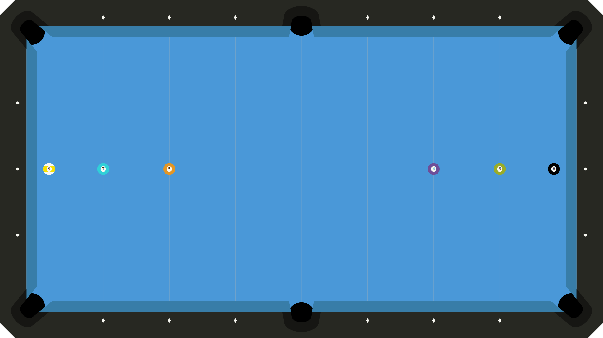

### big4
- Name: D_Longcuts
- Desc: Dynamic endless longcuts.
- Script: [big4.py](./src/big4.py)
- Score: first|max
- Source: Self
- Added: 2023/08/29
- Image:    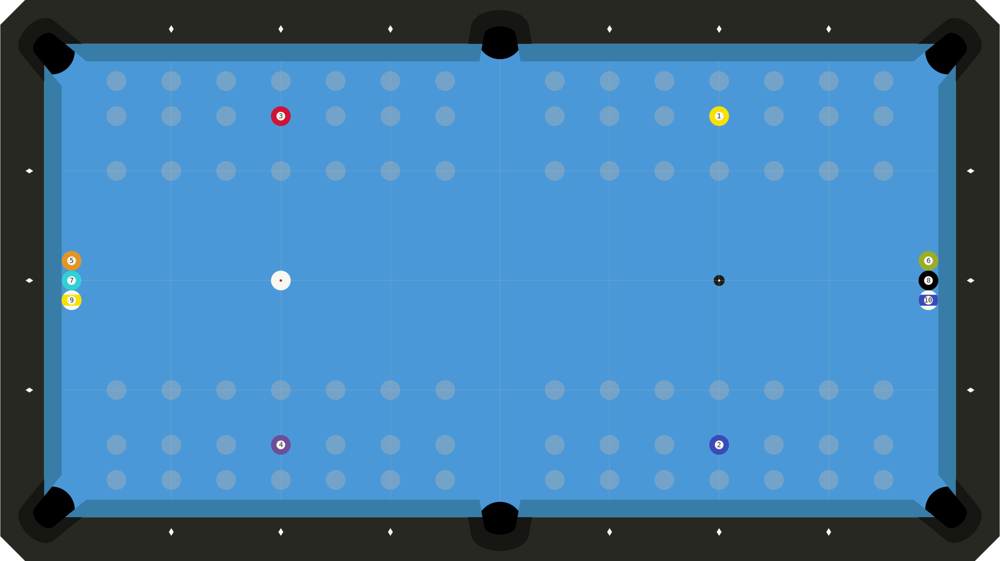

### lil1
- Name: L Drill
- Desc: Endless small cutshots.
- Score: first|max
- Source: IPAT2
- Added: 2023/08/16
- Image:   

### lil2
- Name: Longcuts 1
- Desc: Endless longcuts, BIH between sides.
- Score: first|max
- Source: IPAT2
- Added: 2023/08/16
- Image:   

<!-- ───────────────────────────────────────────────────────────────────────────── -->

## `smk` Shotmaking

<!-- ───────────────────────────────────────────────────────────────────────────── -->

## `drn` Direction
### drn1
- Name: Shortcut Wheel
- Desc: Short rail hero cut shot (L+R).
- Score: num_shots
- Variants: Follow, draw
- Source: Self
- Added: 2023/08/16
- Notes: Previously SMK001, added 2023/02/06.
- Image:    

<!-- ───────────────────────────────────────────────────────────────────────────── -->

# Special
## `bnk` Banks

<!-- ───────────────────────────────────────────────────────────────────────────── -->

## `kik` Kicks
### KIK001
- Desc: Kick each OB one rail.
- Score: # successful
- Source: [Billiard University Exam 2](https://billiarduniversity.org/testing/exams/)
- Added: 2023/02/09

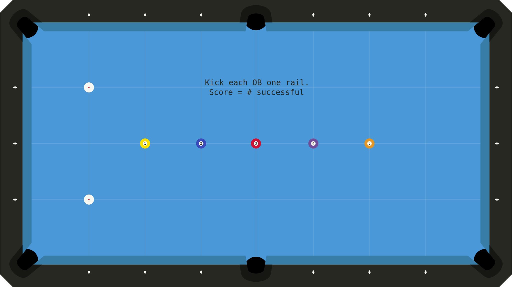

<!-- ───────────────────────────────────────────────────────────────────────────── -->

## `sft` Safeties
### SFT001
Billiard University Exam 2 Safeties Drill (2023/02/08)

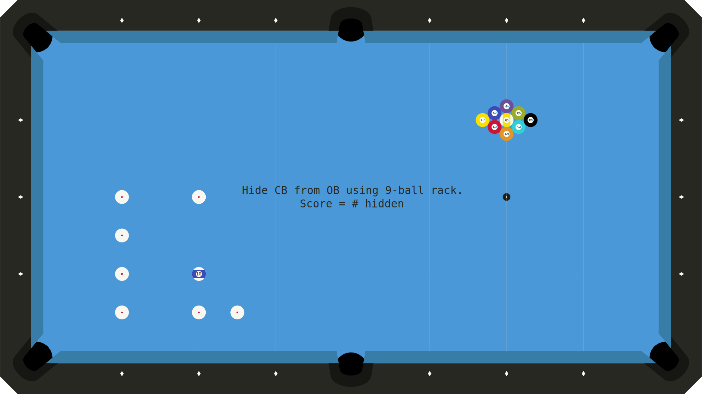

## `brk` Breaks
## `jmp` Jumps

<!-- ───────────────────────────────────────────────────────────────────────────── -->

# Work in Progress
### SMK002
- Desc: Back cut near pocket plus two- or three-rail full table position.
- Score: Shots made with position / 10.
- Source: Self
- Added: 2023/02/07

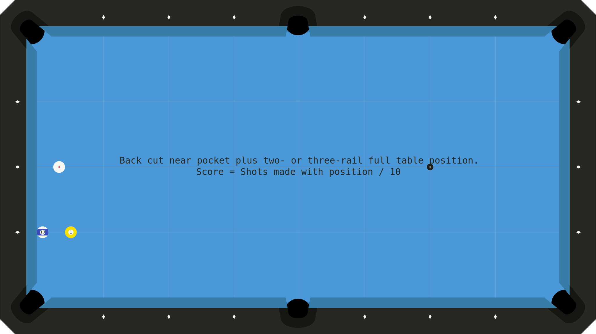

### SMK003
- Desc: Big off-angle follow shot.
- Score: Shots made with position / 10.
- Source: Self
- Added: 2023/02/09
- Notes: Tends to be overcut.

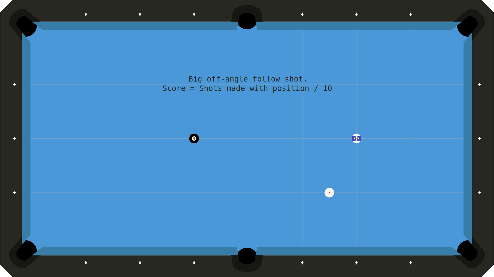

### SMK004
- Desc: Weird short-side thinnish cut shot near end rail.
- Score: Shots made with position / 10.
- Source: Self
- Added: 2023/02/13

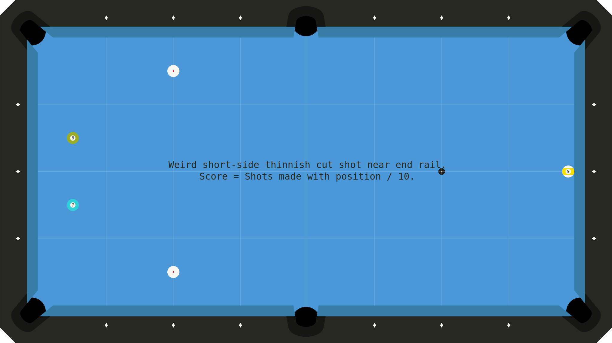

### SMK005
- Desc: Long cut shots into opposite corner.
- Score: Shots made with position / 10.
- Source: Self
- Added: 2023/03/04

### SMK006
- Desc: Tricky not-quite-straight-or-cut shot with follow for position.
- Score: Shots made with position / 10.
- Source: Self
- Added: 2023/03/05
- Notes: Tends to be overcut.

### SMK007
- Desc: 2D to 2D cut shot that comes up in drills I like.
- Score: Shots made with position / 10.
- Source: Self
- Added: 2023/04/02

### SMK008
- Desc: Small angle backcuts with big follow (long rail).
- Score: Attempts required to get 10 successes.
- Source: Self
- Added: 2023/06/18
- Notes: Tends to be overcut.

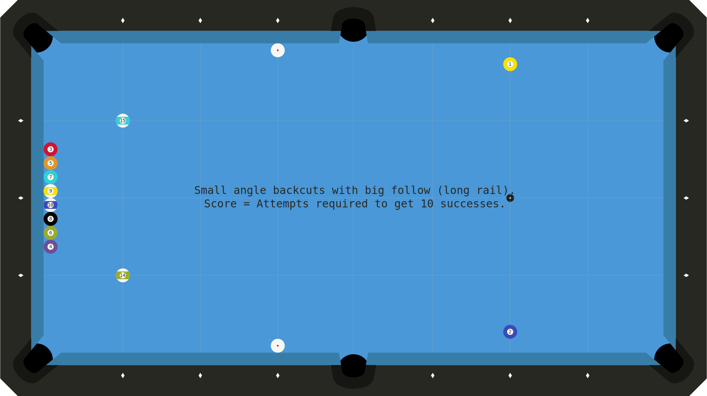

### SMK009
- Desc: Small angle backcuts with big follow (short rail).
- Score: Attempts required to get 10 successes.
- Source: Self
- Added: 2023/06/18
- Notes: Tends to be overcut.

